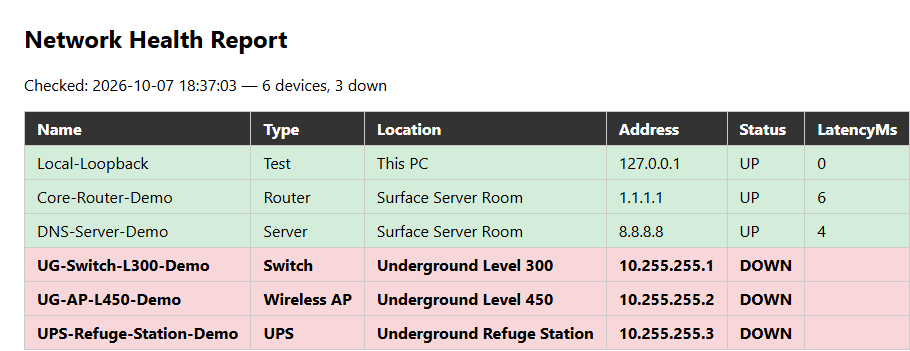

# Site IT Toolkit

PowerShell tools for IT support at a remote industrial site, such as a mine, plant or camp.
I wrote them to automate two everyday technician tasks:

1. **Asset inventory:** record the hardware details of each Windows PC in a CSV asset register.
2. **Network health check:** ping key infrastructure (switches, wireless APs, UPS units, servers) to find which devices are down. Each run is added to a log, and the script builds a colour-coded HTML report.

## Tools

| Script | What it does |
|---|---|
| `Get-AssetInventory.ps1` | Records the hostname, make/model, serial number, OS build, CPU, RAM, disk space, IP and MAC address. Warns when disk space is low. Adds one row to `inventory.csv`. |
| `Test-NetworkHealth.ps1` | Reads the device list from `devices.csv` and pings each device. Records UP/DOWN status and latency, adds the results to `network-log.csv` and writes `network-report.html`. |
| `devices.csv` | Sample device list. The underground devices use unreachable addresses so the report shows what a DOWN device looks like. |

## Usage

```powershell
# Allow local scripts for this session only
Set-ExecutionPolicy -Scope Process -ExecutionPolicy Bypass

# 1. Inventory this PC
.\Get-AssetInventory.ps1

# 2. Check network devices and open the report
.\Test-NetworkHealth.ps1
Start-Process .\network-report.html
```

To monitor your own network, edit `devices.csv` with real device names, locations and IP addresses.

To run the health check automatically, set up a Windows Task Scheduler job, for example every 15 minutes.

## Screenshot



## Skills demonstrated

- Windows administration with PowerShell and WMI/CIM
- IT asset management and documentation
- Network troubleshooting (ICMP reachability and latency)
- Infrastructure monitoring and incident logging
- Reporting (CSV and HTML)

## Ideas for future improvements

- Run the inventory on remote PCs with `Invoke-Command`
- Send an email or Teams alert when a device goes down
- Check ports (`Test-NetConnection -Port`) as well as ping
